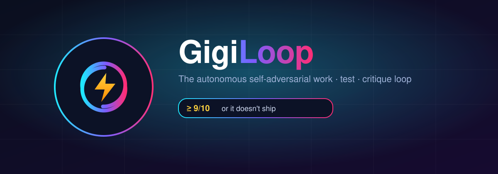
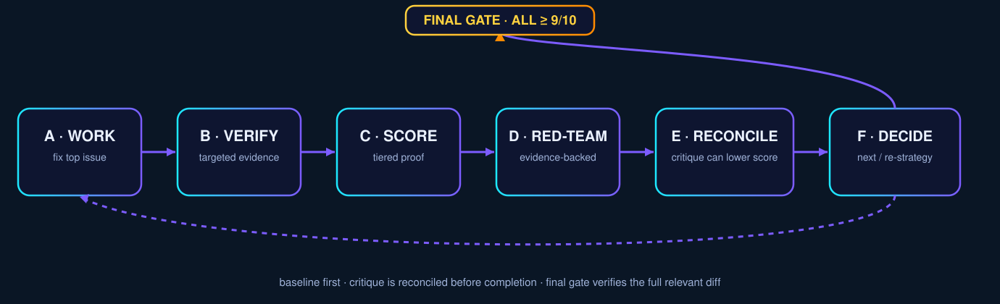

# ⚡ GigiLoop — Verification-First Autonomous Coding



> **Build → test → red-team → reconcile → verify → repeat. GigiLoop keeps working until your acceptance criteria are backed by evidence, not agent confidence.**

GigiLoop is an autonomous coding skill for OpenCode and compatible agent-skill hosts. It is designed for the moment when "keep trying until it works" is not enough: it establishes a baseline, defines measurable acceptance criteria, iterates on the highest-impact issue, adversarially reviews its own diff, reconciles scores after critique, and only ships after a final verification gate.

**Think Ralph Loop, but with a hostile reviewer and an evidence gate.**

No vibes. No "looks good to me." **Proof or it does not pass.**

---

## Why GigiLoop exists

Naive autonomous loops have predictable failure modes. GigiLoop is built to counter them directly:

| Naive autonomous loop | GigiLoop |
|---|---|
| "Rate yourself 0–10 and keep going" | **Evidence-gated scoring** — every pass condition must point to tests, command output, reproducible behavior, or a precise code reference. |
| Treats every failing test as its own regression | **Baseline awareness** — records pre-existing failures before editing. |
| Critiques itself, then ignores the critique | **Score reconciliation** — confirmed findings can lower scores before completion is decided. |
| Invents problems to satisfy a critique quota | **Evidence-gated red-team** — report up to three material findings; never fabricate one to hit a number. |
| Uses the same context to approve its own work | **Independent reviewer when available** — fresh-context/subagent review is preferred, with self-adversarial fallback. |
| Re-runs an expensive full suite after every tiny edit | **Progressive verification** — targeted checks during iterations, full relevant verification at milestones and the final gate. |
| Loops forever on a plateau | **Plateau → re-strategy** — three flat iterations force a genuinely different approach. |
| Resumes from stale memory after the repo changed | **Checkpoint validation** — branch/HEAD/diff state is compared before reusing old evidence. |
| Averages strong criteria over weak ones | **All-criteria gate** — every acceptance criterion must clear the threshold. |
| Declares victory at the first green test | **Final Gate** — full relevant verification + diff review + final adversarial pass. |
| Never admits defeat | **Honest exit** — blocker or budget reports instead of a fabricated 9/10. |

---

## The loop

```text
GOAL + BASELINE + RUBRIC
          │
          ▼
      A. WORK
          │
          ▼
      B. VERIFY
          │
          ▼
      C. SCORE
          │
          ▼
     D. RED-TEAM
          │
          ▼
    E. RECONCILE
          │
          ▼
      F. DECIDE
      │       │
   < 9/10   all ≥ 9/10
      │       │
      └──┐    ▼
         └─ FINAL GATE ──► DONE
```



---

## Install

### Recommended — Agent Skills CLI

```bash
npx skills add CultureDigitali/gigiloop --skill gigiloop -a opencode
```

Install globally:

```bash
npx skills add CultureDigitali/gigiloop --skill gigiloop -a opencode -g
```

### Manual

```bash
git clone https://github.com/CultureDigitali/gigiloop ~/.config/opencode/skills/gigiloop
```

If your host uses a different Agent Skills directory, copy the `gigiloop/` folder into that location.

---

## Usage

Invoke GigiLoop with a concrete goal:

```text
gigiloop: fix the login regression and harden the auth flow until every acceptance criterion is verified at 9/10
```

```text
gigiloop: build an idempotent payments endpoint with tests; don't stop at the happy path
```

```text
gigiloop: make this React component production-grade, focusing on keyboard accessibility and regression safety
```

```text
gigiloop: keep iterating until the failing CI job is fixed without introducing regressions
```

Optional constraints can be included naturally:

```text
max 8 iterations
ship when solid; don't chase 10
stay inside src/auth/**
do not change the public API
```

---

## What gets checkpointed

GigiLoop writes resumable state to `.gigiloop/checkpoint.md` when the project is writable. The checkpoint tracks:

- goal, scope, constraints, and budget;
- branch, HEAD, and repository state;
- baseline verification and pre-existing failures;
- weighted rubric and evidence tiers;
- current scores and evidence;
- confirmed findings and unresolved hypotheses;
- iteration count and next action.

If the repository changes outside the loop, stale evidence is invalidated before work resumes.

See [`gigiloop/references/checkpoint.md`](gigiloop/references/checkpoint.md).

---

## Evidence tiers

A score is only as strong as the verification behind it. GigiLoop caps confidence according to the evidence available:

| Evidence tier | Typical evidence | Practical ceiling |
|---|---|---:|
| T0 | intuition / unsupported claim | 4/10 |
| T1 | static inspection only | 6/10 |
| T2 | lint, typecheck, build, deterministic static checks | 7/10 |
| T3 | targeted automated tests / reproducible behavior | 8/10 |
| T4 | tests + adversarial edge cases + relevant integration verification | 9/10 |
| T5 | T4 + independent/fresh-context review + clean final gate | 10/10 |

The exact ceiling is context-dependent; the rule is simple: **a strong score requires proportionally strong evidence.**

See [`gigiloop/references/scoring.md`](gigiloop/references/scoring.md).

---

## Benchmarks: prove it, do not market fiction

The original GigiLoop examples described plausible outcomes such as catching retry idempotency bugs, secret leakage, and accessibility regressions. Those are useful scenarios, but they are **not presented as measured benchmark results unless they have actually been reproduced**.

The repository now includes a benchmark protocol in [`benchmarks/README.md`](benchmarks/README.md) for comparing:

- a normal one-pass coding agent;
- a naive keep-going/Ralph-style loop;
- GigiLoop;

from the same starting commit, with the same model/host and hidden or independently evaluated checks.

Measured results will be published only with reproducible fixtures and raw evidence.

---

## Design principles

- **Evidence over confidence**
- **Critique can invalidate a pass**
- **No fake flaw quotas**
- **Baseline before blame**
- **Fast local loop, strong final gate**
- **Fresh-context review when possible**
- **Checkpoint state, but distrust stale state**
- **Fail honestly when blocked**

---

## Repository layout

```text
.
├── README.md
├── CHANGELOG.md
├── CONTRIBUTING.md
├── SECURITY.md
├── assets/
│   ├── banner.svg
│   └── loop.svg
├── benchmarks/
│   └── README.md
├── gigiloop/
│   ├── SKILL.md
│   └── references/
│       ├── checkpoint.md
│       ├── scoring.md
│       └── verification.md
└── .github/
    └── workflows/
        └── validate-skill.yml
```

---

## Contributing

Reproducible benchmark cases, failure reports, portability fixes, and reviewer strategies are especially useful. See [`CONTRIBUTING.md`](CONTRIBUTING.md).

If GigiLoop helps you catch something a normal coding pass would have shipped, open a benchmark case or issue with the evidence.

---

## 📣 Share

Ready-to-post drafts for every free channel: [`marketing/`](marketing/) (Show HN, Reddit, X, LinkedIn, Product Hunt, Lobsters, case study).

Discussion: [github.com/CultureDigitali/gigiloop/discussions](https://github.com/CultureDigitali/gigiloop/discussions)

---

## License

MIT.

---

⭐ **If GigiLoop improves a real result, star the repository and share the reproducible case.** Evidence is more useful than hype.
