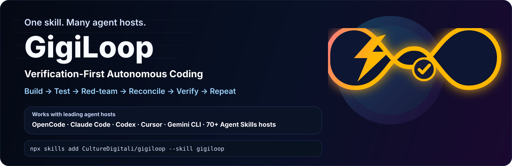

# ⚡ GigiLoop — Verification-First Autonomous Coding



<p align="center">
  <strong>The loop that does not trust itself.</strong><br>
  Build → Test → Red-team → Reconcile → Verify → Repeat.
</p>

<p align="center">
  <a href="#install">Install</a> ·
  <a href="#works-across-agent-hosts">Compatibility</a> ·
  <a href="COMPATIBILITY.md">Host guide</a> ·
  <a href="benchmarks/README.md">Benchmarks</a> ·
  <a href="CONTRIBUTING.md">Contribute</a>
</p>

GigiLoop is a **verification-first autonomous coding skill** for OpenCode, Claude Code, Codex, Cursor, Gemini CLI and the wider Agent Skills ecosystem. It turns “keep trying until it works” into a bounded engineering protocol: baseline the repo, define measurable acceptance criteria, iterate on the highest-impact gap, attack the diff, reconcile the evidence, and only ship after a final verification gate.

> **Think Ralph Loop, but with a hostile reviewer and an evidence gate.**

No vibes. No “looks good to me.” **Proof or it does not pass.**

---

## Works across agent hosts

The canonical `gigiloop/SKILL.md` is intentionally host-neutral. The open Agent Skills CLI can install skills across a large set of coding agents; GigiLoop additionally ships small host adapters where a native workflow file is useful.

| Host | Install target | Support |
|---|---|---|
| **OpenCode** | `opencode` | ✅ Native Agent Skill |
| **Claude Code** | `claude-code` | ✅ Native Agent Skill |
| **Codex** | `codex` | ✅ Native + `AGENTS.md` adapter |
| **Cursor** | `cursor` | ✅ Native + optional `.mdc` rule |
| **Gemini CLI** | `gemini-cli` | ✅ Native + `GEMINI.md` adapter |
| **GitHub Copilot** | `github-copilot` | ✅ Agent Skill |
| **Cline** | `cline` | ✅ Agent Skill |
| **OpenHands** | `openhands` | ✅ Agent Skill |
| **Amp** | `amp` | ✅ Agent Skill |
| **Many more** | interactive detection | ✅ Agent Skills ecosystem |

See [`COMPATIBILITY.md`](COMPATIBILITY.md) for installation paths, adapters, and portability rules.

### Official brand resources

Compatibility is descriptive; it does not imply endorsement or partnership. Where vendor marks are displayed or reused, use the original vendor-controlled assets and guidelines:

- [OpenCode brand assets](https://opencode.ai/brand)
- [Claude / Anthropic press assets](https://www.anthropic.com/news)
- [OpenAI brand guidelines](https://openai.com/brand/)
- [Cursor brand assets](https://cursor.com/brand)
- [Google Brand Resource Center](https://about.google/brand-resource-center/)

See [`assets/BRANDING.md`](assets/BRANDING.md) and [`assets/host-logos/README.md`](assets/host-logos/README.md). GigiLoop’s own mark is [`assets/logo-v2.svg`](assets/logo-v2.svg).

---

## Why GigiLoop exists

Naive autonomous loops fail in predictable ways. GigiLoop builds controls directly around those failure modes.

| Naive autonomous loop | GigiLoop |
|---|---|
| “Rate yourself and keep going” | **Evidence-gated scoring** — tests, command output, reproducible behavior, or precise code references. |
| Treats every failing test as its own regression | **Baseline awareness** — pre-existing failures are recorded before edits. |
| Critiques itself, then ignores the critique | **Score reconciliation** — confirmed findings can lower a previously passing score. |
| Invents problems to satisfy a quota | **Evidence-gated red-team** — up to three material findings; never fabricate one. |
| Uses the same context to approve its own work | **Independent reviewer when available** — fresh-context/subagent review is preferred. |
| Re-runs an expensive full suite after every tiny edit | **Progressive verification** — fast affected checks while iterating, broad checks at milestones/final gate. |
| Loops forever on a plateau | **Plateau → re-strategy** — repeated flat progress forces a genuinely different approach. |
| Resumes from stale memory after the repo changed | **Checkpoint validation** — stale evidence is invalidated when repository state changes. |
| Averages strong criteria over weak ones | **All-criteria gate** — every criterion must clear the requested threshold. |
| Declares victory at the first green test | **Final Gate** — relevant full verification + complete diff review + final adversarial pass. |
| Never admits defeat | **Honest exit** — blocker or budget reports instead of fabricated success. |

---

## The loop

```text
GOAL + BASELINE + RUBRIC
          │
          ▼
      A. WORK
          │
          ▼
      B. VERIFY
          │
          ▼
      C. SCORE
          │
          ▼
     D. RED-TEAM
          │
          ▼
    E. RECONCILE
          │
          ▼
      F. DECIDE
      │       │
   below     all criteria
 threshold   verified
      │       │
      └──┐    ▼
         └─ FINAL GATE ──► DONE
```


---

## Install

### One command

```bash
npx skills add CultureDigitali/gigiloop --skill gigiloop
```

Choose your detected agent interactively, or target one explicitly:

```bash
# OpenCode
npx skills add CultureDigitali/gigiloop --skill gigiloop -a opencode

# Claude Code
npx skills add CultureDigitali/gigiloop --skill gigiloop -a claude-code

# Codex
npx skills add CultureDigitali/gigiloop --skill gigiloop -a codex

# Cursor
npx skills add CultureDigitali/gigiloop --skill gigiloop -a cursor

# Gemini CLI
npx skills add CultureDigitali/gigiloop --skill gigiloop -a gemini-cli

# All detected/supported targets
npx skills add CultureDigitali/gigiloop --skill gigiloop --agent '*'
```

Add `-g` for a global/user-level installation.

### Manual

Copy the `gigiloop/` folder into the Agent Skills directory used by your host. The host-specific wrappers under `adapters/` and `.cursor/rules/` are optional conveniences; `gigiloop/SKILL.md` remains the source of truth.

---

## Usage

Invoke GigiLoop with a concrete engineering goal:

```text
gigiloop: fix the login regression and harden the auth flow until every acceptance criterion is verified at 9/10
```

```text
gigiloop: build an idempotent payments endpoint with tests; don't stop at the happy path
```

```text
gigiloop: make this React component production-grade, focusing on keyboard accessibility and regression safety
```

```text
gigiloop: keep iterating until the failing CI job is fixed without introducing regressions
```

Natural constraints work too:

```text
max 8 iterations
ship when solid; don't chase 10
stay inside src/auth/**
do not change the public API
```

---

## Evidence tiers

A strong score requires proportionally strong evidence.

| Tier | Typical evidence | Practical ceiling |
|---|---|---:|
| T0 | intuition / unsupported claim | 4/10 |
| T1 | static inspection only | 6/10 |
| T2 | lint, typecheck, build, deterministic static checks | 7/10 |
| T3 | targeted automated tests / reproducible behavior | 8/10 |
| T4 | tests + adversarial edge cases + relevant integration verification | 9/10 |
| T5 | T4 + independent/fresh-context review + clean final gate | 10/10 |

See [`gigiloop/references/scoring.md`](gigiloop/references/scoring.md).

---

## Resumable without trusting stale state

When the project is writable, GigiLoop uses `.gigiloop/checkpoint.md` to track goal, scope, constraints, repository state, baseline failures, rubric, current evidence, findings, iteration count, and next action.

If the repository changes outside the loop, affected evidence is invalidated before resuming. See [`gigiloop/references/checkpoint.md`](gigiloop/references/checkpoint.md).

---

## Host portability

Host-specific features are accelerators, not dependencies. GigiLoop can use a subagent/fresh context for independent review, a host task list for mirrored state, or hooks for deterministic checks when available. The evidence contract remains the same when those features do not exist.

See [`gigiloop/references/hosts.md`](gigiloop/references/hosts.md) and [`COMPATIBILITY.md`](COMPATIBILITY.md).

---

## Benchmarks: prove it, do not market fiction

GigiLoop does **not** publish invented success rates. [`benchmarks/README.md`](benchmarks/README.md) defines a reproducible comparison protocol for a normal one-pass coding agent, a naive keep-going / Ralph-style loop, and GigiLoop from the same starting commit with comparable model/host budgets and independent or hidden checks where practical.

Measured claims belong in the README only after raw evidence can reconstruct them.

---

## Design principles

- **Evidence over confidence**
- **Critique can invalidate a pass**
- **No fake flaw quotas**
- **Baseline before blame**
- **Fast local loop, strong final gate**
- **Fresh-context review when possible**
- **Checkpoint state, distrust stale state**
- **One canonical skill across hosts**
- **Fail honestly when blocked**

---

## Repository layout

```text
.
├── README.md
├── COMPATIBILITY.md
├── CHANGELOG.md
├── CONTRIBUTING.md
├── SECURITY.md
├── assets/
│   ├── logo-v2.svg
│   ├── banner-v2.svg
│   ├── loop.svg
│   ├── BRANDING.md
│   └── host-logos/README.md
├── adapters/
│   ├── codex/AGENTS.md
│   └── gemini-cli/GEMINI.md
├── .cursor/rules/gigiloop.mdc
├── benchmarks/README.md
├── marketing/
└── gigiloop/
    ├── SKILL.md
    ├── agents/openai.yaml
    └── references/
        ├── checkpoint.md
        ├── hosts.md
        ├── scoring.md
        └── verification.md
```

---

## Contributing

Reproducible benchmark cases, failure reports, portability fixes, host adapters, and reviewer strategies are especially useful. See [`CONTRIBUTING.md`](CONTRIBUTING.md).

If GigiLoop catches something a normal coding pass would have shipped, open a benchmark case with the evidence.

---

## 📣 Share

Ready-to-post launch drafts for free developer channels live in [`marketing/`](marketing/), including Show HN, Reddit, X, LinkedIn, Product Hunt, Lobsters, and the self-case-study.

Discussion: [github.com/CultureDigitali/gigiloop/discussions](https://github.com/CultureDigitali/gigiloop/discussions)

---

## License

MIT. Third-party names and marks remain property of their respective owners and are referenced only to describe compatibility.

---

⭐ **If GigiLoop improves a real result, star the repository and share the reproducible case. Evidence is more useful than hype.**
